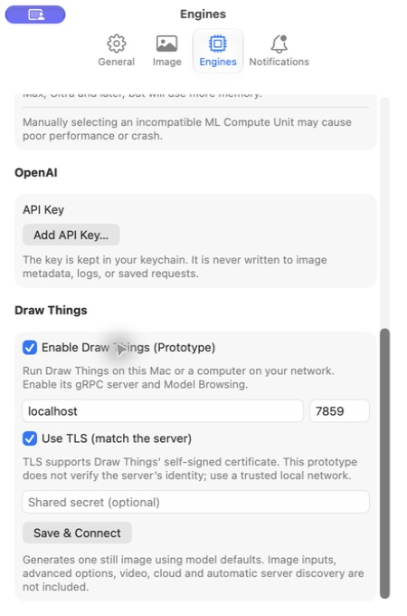

# Draw Things proof of concept

**Deferred from the next release, 2026-09-10.** Graham has postponed Draw Things because
the prototype's supported paths do not yet establish the desired level of polish across
edge cases. This document preserves setup, scope and evidence for that future work; it is
not a release promise or a task list. Beads task `MochiDiffusion-fwu` covers preserving the
prototype on a feature branch and removing its integration and exclusive dependencies from
the release line. The code and this record are preserved on branch
`codex/draw-things-prototype` at `e18663b3877bd42fac9fe169063a052b567a4f8a`.
Broader implementation work resumes only when Graham chooses; there is no target date.

Implemented September 6, 2026. One **Draw Things** engine connects to the Draw Things
application or a compatible standalone gRPC server, on this Mac or another LAN machine.
It lists supported installed models and compatible LoRAs, accepts a prompt, seed and size, requests one still image,
and saves it through Mochi's existing queue, metadata encoder, and gallery.

## Try it

1. In Draw Things, download a text-to-image model. FLUX.2 Klein 4B, SD 1.5, or SDXL
   are useful starting points. Keep Draw Things running while generating.
2. Enable its **gRPC/API Server** and **Model Browsing**. Model browsing is required:
   this prototype reads the server's `Echo.override.models`, not a list of models
   available to download. For the standalone server, enable `--model-browser`.
3. Note the server's listening port (normally **7859**), TLS setting, and optional
   shared secret. Match TLS on both sides. Response compression can be enabled.
4. Open Mochi's **Settings → Engines**, scroll to **Draw Things**, and enable it.
   Use `localhost` for Draw Things on the same Mac; use the other machine's LAN
   hostname or IPv4 address for a remote server. Enter the port and optional secret.
5. Click **Save & Connect**. A successful connection selects Draw Things in the sidebar.
   Choose a model, enter a prompt, and click **Generate**. The image appears in the
   gallery and is saved to the configured Images Folder.
6. Set **Width** and **Height** in the sidebar. Use **Add LoRA** below the model controls
   to select installed LoRAs and adjust their weights. Add any displayed trigger words
   to your prompt yourself. Multiple LoRAs can be combined; remove one with its minus button.
7. Click **Save & Connect** again after downloading models or LoRAs or changing the server.

On a LAN, the server must listen on a network-accessible interface, its firewall must
allow the port, and macOS must allow Mochi local-network access if it asks. There is no
Bonjour discovery in this experiment. Hostnames and IPv4 addresses are supported; IPv6
address entry is deferred. There are no public internet or Draw Things cloud connections.

The shared secret is stored in Keychain, scoped to host, port and TLS mode. Leaving the
field blank keeps a saved secret; the removal checkbox deletes it. Connection settings
are stored under `Engine.drawthings.Options`, separate from global generation preferences.
TLS supports the self-signed certificate used by Draw Things but does **not** verify the
server's identity in this prototype. Use a trusted local network.

## Scope and model defaults

Generation is text-to-image only, one image at a time. Steps and guidance remain pinned
to the selected model's defaults. Width and height are editable from 64–2048 pixels in
64-pixel increments; rectangular images are supported. These are prototype limits, not
a guarantee that every model or server has enough memory for every size.
There is no negative prompt, image input, ControlNet, advanced option
editor, video, preview display, automatic server discovery, or embedded Draw Things
inference library. “On this Mac” still means connecting to a running Draw Things server.

LoRAs come from `Echo.override.loras`; only matching model versions are offered.
The prototype excludes consistency, inpainting and alternate-decoder LoRAs because
they need generation options this UI does not expose. Weights use the server's range
and recommended value, falling back to −1.5…2.5 and 1.0. LoRA selections are temporary:
switching models or servers clears them, and they are not restored after quitting Mochi.
Refreshing the same catalog preserves selections that are still valid. Each queued
request retains its own selections and full LoRA specifications. LoRAs do not change
the model's steps or sampler automatically.

`DrawThingsPresets.json` is an unmodified snapshot of the
[official configuration catalog](https://models.drawthings.ai/configs.json), retrieved
September 6, 2026. The resolver matches model filenames across quantization suffixes,
then falls back to a matching version's template. Templates needing LoRAs or ControlNets
are excluded. Versions with no template use the client defaults with diffusion-family
adjustments; this is a prototype resolver, not the full MediaGenerationKit resolver.
Each model carries its own configuration, so switching models cannot inherit another
model's settings. The picker filters unsupported versions, video, and editing-only models;
FLUX.2 Klein's text generation remains available despite its optional image-edit capability.
Fine-tunes may need settings beyond what this minimal resolver knows.

Mochi's sampler type still describes Core ML. The prototype sends the Draw Things sampler
from the model template but intentionally omits the sampler metadata field and control.
It does not record a fictitious Core ML sampler. Exported images include engine, model key,
prompt, dimensions, seed, steps, guidance, and LoRA filenames/weights. The Info panel
shows LoRAs; Copy to Sidebar restores them when the matching model is selected and they
remain available. Complete advanced-setting reproduction and
the broader metadata changes in Engine-Future-Work §4 remain future work.

## How it fits

- `DrawThingsEngine` implements the existing typed descriptor and synchronous planner.
  Discovery carries the full server-supplied model specification forward, preserving
  unknown fields, and replays it in the generation request's `MetadataOverride`.
- `DrawThingsRuntime` implements the existing runtime. The queue, result persistence,
  and gallery need no Draw Things-specific behavior. A queued payload retains its
  original endpoint, even if connection settings subsequently change.
- `GRPCDrawThingsTransport` owns network work. It uses gRPC async calls directly with a
  10-second discovery deadline, a 30-minute total generation deadline, and the existing
  queue's five-minute idle watchdog. Session cancellation cancels the underlying call.
  Cancellation has also been checked manually against Draw Things.
- Transport reassembles final image chunks before decoding Draw Things tensors. Empty,
  incomplete, oversized, or unexpected multiple-image responses fail. A preview is never
  treated as a completed result. A result write failure still fails the generation.
- Unconfigured Draw Things performs no network discovery. Its discovery failure cannot
  erase other engines' models. Settings displays the actionable discovery error.

## Research and dependency choice

Read `Engine-Future-Work.md` §5 and the closed `Multi-Engine-Design.md` record first.
They favor one engine with a connection setting and flag discovery, metadata replay,
model-seeded defaults, sampler vocabulary, and dependency weight as integration concerns.

[TanqueStudio](https://github.com/skeptict/TanqueStudio) demonstrates the UI/server setup
and model-list workflow. [DT-gRPC-Swift-Client](https://github.com/euphoriacyberware-ai/DT-gRPC-Swift-Client)
provides the public protobuf messages, FlatBuffer configuration encoder, and tensor codec.
This prototype pins that client to revision `2e44f4f99e742709eb90cfd96ff3fe10198421c1`.
The new direct products are DrawThingsClient, GRPC, and NIO; transitive dependencies are
recorded in `Package.resolved`. MediaGenerationKit and its inference stack are not linked.

The client's higher-level `echo()` lacks a deadline and waits on an event-loop future.
A task-group timeout like the example app uses can still wait for that child on scope
exit. Our small adapter instead uses gRPC's cancellable async calls with real deadlines.
It also supplies the discovered specification explicitly and avoids the higher-level
service's automatic public catalog fetch.

## Validation

- The full app test suite passed on September 7: **573 test cases**, including Draw Things
  discovery, defaults, planning, credential scoping, persistence, chunk handling,
  cancellation, failure recovery, size, LoRAs, and gallery-ready image encoding.
- The suite includes a **real loopback gRPC test**: Echo authentication, serialized
  generation parameters, prompt/seed/secret/specification, chunked response assembly,
  and tensor decoding. Its image is a synthetic fixture, not an inference result.
- Inspected the new connection pane in the running app and captured the screenshot above.
- Graham subsequently verified real image generation on both the same Mac and a LAN
  machine, and successful cancellation. An intermittent remote stall could no longer
  be reproduced; its cause remains unconfirmed.
- Follow-up regression checks cover failed/empty/cancelled requests followed by successful
  retries, queue-based button state, size resolution, LoRA compatibility/weights,
  immutable selections, server/model changes, and LoRA image metadata round trips.
  The loopback test also verifies rectangular dimensions and LoRA overrides on the wire.
- Generation notifications now count saved images. A drain that saves no images sends
  no success notification; a mixed batch reports only the number actually saved.
- The new size and LoRA controls still need a real Draw Things generation check.

### Build environment caveat

The installed toolchain is `/Applications/Xcode-beta.app` (the default developer directory
points to Command Line Tools). The source snapshot had lost the executable bit on
`scripts/build_iris_lib.sh`; that permission was restored.

CompactSlider 1.2.1 is now vendored in `Vendor/CompactSlider`, with its MIT license and
provenance. The project uses that local package. Its `ProminentCompactSliderStyle`
wraps the gradient in `AnyView` to resolve the SDK's ambiguous `opacity` overload;
a brief comment explains the fix. No package-cache edit is needed for a clean build.

The resulting Debug app is at
`/tmp/mochi-drawthings-build/Build/Products/Debug/Mochi Diffusion.app` (approximately 79 MB).
No reliable before/after app-size or build-time comparison was obtained because the
baseline does not build unchanged on this toolchain.

The source passes `swift format lint`.
