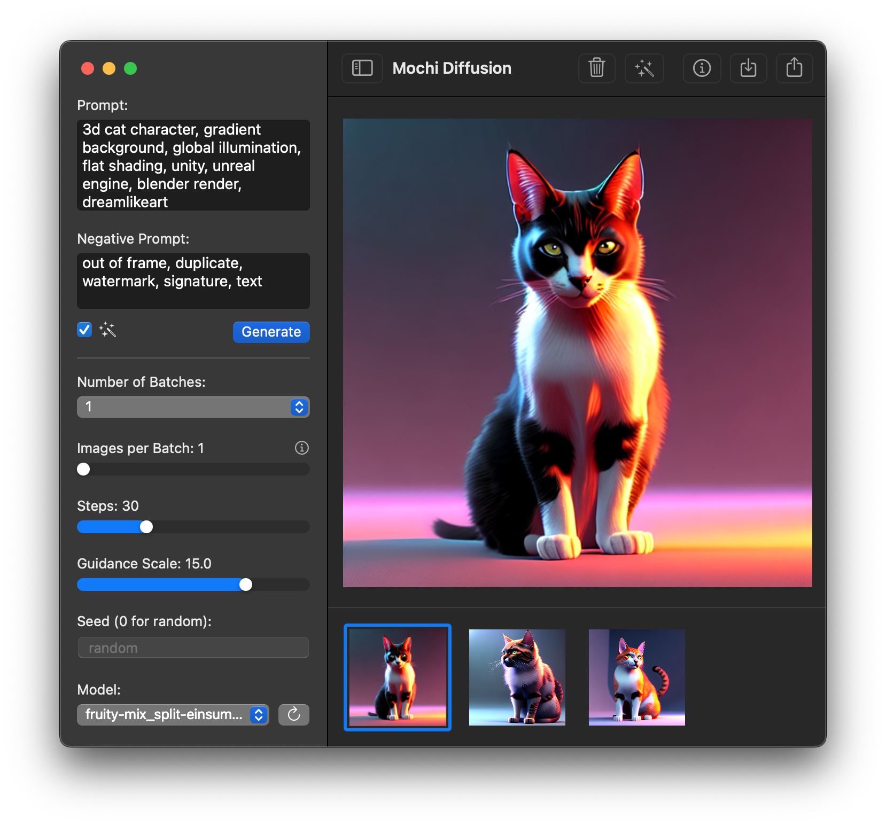

<p align="center">

</p>

<h1 align="center">Mochi Diffusion (모찌)</h1>

<p align="center">Mac을 위한 Stable Diffusion</p>

<p align="center">
<a href="https://github.com/MochiDiffusion/MochiDiffusion/blob/main/README.md">English</a>,
<a href="https://github.com/MochiDiffusion/MochiDiffusion/blob/main/README.ko.md">한국어</a>,
<a href="https://github.com/MochiDiffusion/MochiDiffusion/blob/main/README.zh-Hans.md">中文</a>
</p>

<p align="center">
<a title="Discord" target="_blank" href="https://discord.gg/x2kartzxGv"></a>
<a title="Crowdin" target="_blank" href="https://crowdin.com/project/mochi-diffusion"></a>
<a title="License" target="_blank" href="https://github.com/MochiDiffusion/MochiDiffusion/blob/main/LICENSE"></a>
</p>



## 설명

이 앱은 [Apple Core ML Stable Diffusion](https://github.com/apple/ml-stable-diffusion)을 사용하여 메모리 요구 사항을 줄이면서 Apple Silicon Mac에서 최대 성능과 속도를 달성합니다.

## 기능

- 매우 빠르고 메모리 효율적 (Neural Engine을 사용해서 ~150MB)
- 모든 Apple Silicon Mac에 잘 실행됨
- 본인의 Mac에서 완전히 오프라인으로 이미지 생성
- 생성된 이미지는 메타데이터 내에 프롬프트 정보가 함께 저장됩
- 생성된 이미지를 고화질로 변환할수 있는 기능 (RealESRGAN 사용)
- 사용자 지정으로 원하는 Stable Diffusion Core ML 모델 사용 가능
- 피클된 모델 걱정 없음
- SwiftUI을 사용해서 macOS을 위해 만듬

## 설치

[Releases](https://github.com/MochiDiffusion/MochiDiffusion/releases) 페이지에서 최신 버전을 다운로드 하실수 있습니다.

## 실행

모델을 처음 사용하는 경우 Neural Engine이 캐시된 버전을 만드는데 최대한 2분 정도 걸릴 수 있습니다. 이후에는 이미지 생산이 훨씬 빨라질 것입니다.

## Compute Unit

- `CPU & Neural Engine`는 빠른 속도와 낮은 메모리 사용량 간의 적절한 균형을 제공
- `CPU & GPU`는 M1 Max, Ultra에서 더 빠를 수 있지만 더 많은 메모리를 사용

선택한 옵션에 따라 적절한 모델 버전을 사용해야 합니다 (자세한 내용은 모델 섹션 참조).

## 모델

Mochi Diffusion을 사용하려면 모델 파일을 Core ML 포맷으로 변환하거나 다운로드해야 합니다.

몇 가지 모델을 변환하여 [여기](https://huggingface.co/coreml-community)에 업로드 해놨습니다.

1. Core ML 모델로 [변환 하거나](https://github.com/MochiDiffusion/MochiDiffusion/wiki/How-to-convert-Stable-Diffusion-models-to-Core-ML) 다운
    - `split_einsum` 버전은 Neural Engine을 포함한 모든 Compute Unit 옵션과 사용 가능
    - `original` 버전은 `CPU & GPU` 옵션과만 사용 가능
2. 기본 앱 모델 폴더는 홈 디렉토리 아래에 생성됩니다. 이 위치는 설정에서 변경 할 수 있습니다
3. 모델 폴더에서 앱에 표시할 이름으로 새 폴더를 만든 다음 변환된 모델을 여기로 이동하거나 추출함
4. 폴더 디렉토리는 다음과 같아야 합니다:
```
<사용자 홈 폴더>/
└── MochiDiffusion/
    └── models/
        ├── stable-diffusion-2-1_split-einsum_compiled/
        │   ├── merges.txt
        │   ├── TextEncoder.mlmodelc
        │   ├── Unet.mlmodelc
        │   ├── VAEDecoder.mlmodelc
        │   ├── VAEEncoder.mlmodelc
        │   └── vocab.json
        ├── ...
        └── ...
```

## 시스템 요구 사항

- Apple Silicon칩 (M1와 이후 모델)
- macOS Sonoma 14.0 와 이후 버전
- Xcode 15.2 (to build)

## 개인 정보

모든 생성은 본인의 맥에서 발생하며 클라우드로 전송되는 것은 전혀 없습니다.

## 기여

Mochi Diffusion은 버그 보고서, 코드 또는 새로운 번역을 통해서든 항상 기여를 찾고 있습니다.

- 버그를 발견했거나 새로운 기능이나 개선 사항을 제안하고 싶다면 [문제를 먼저 검색](https://github.com/MochiDiffusion/MochiDiffusion/issues)해 보세요. 중복을 방지하는 데 도움이 됩니다. 문제를 찾을 수 없으면 [새 문제를 생성](https://github.com/MochiDiffusion/MochiDiffusion/issues/new/choose)하세요.

- 코드를 제공하고 싶다면 언제든지 새 [Pull Request를](https://github.com/MochiDiffusion/MochiDiffusion/pulls) 열 수 있습니다.

## 크레딧

- [Apple's Core ML Stable Diffusion implementation](https://github.com/apple/ml-stable-diffusion)
- [Hugging Face's Swift UI sample implementation](https://github.com/huggingface/swift-coreml-diffusers)
- [Zabriskije](https://github.com/Zabriskije)가 만든 앱 아이콘
