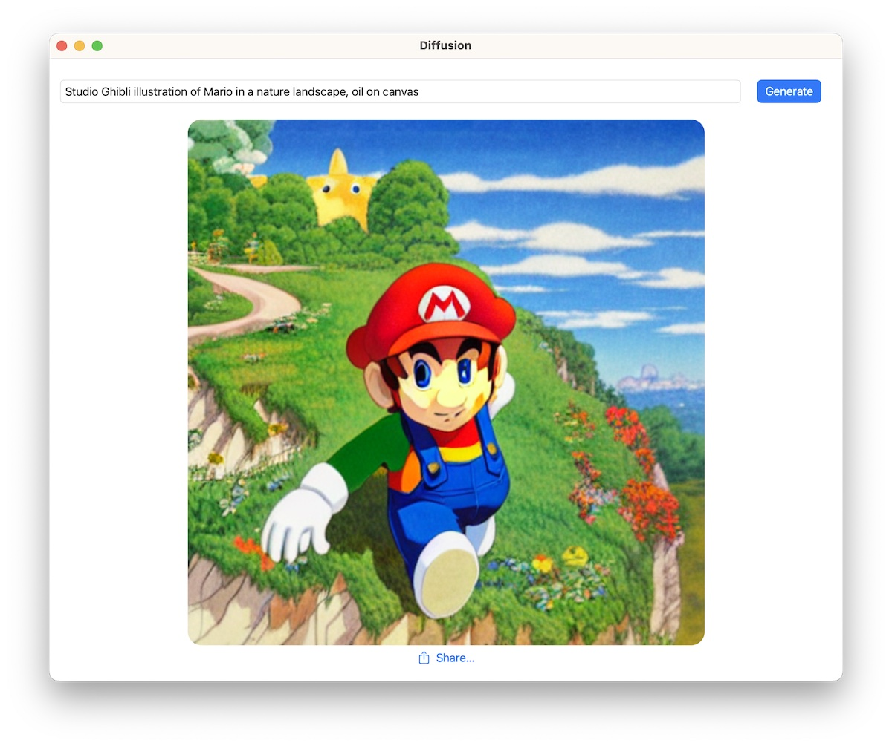

#  Diffusion

This is a simple app that shows how to integrate Apple's [Core ML Stable Diffusion implementation](https://github.com/apple/ml-stable-diffusion) in a native Swift UI application. It can be used for faster iteration, or as sample code for other use cases.

This is what it looks like:

On first launch, the application downloads a zipped archive with a Core ML version of Runway's Stable Diffusion v1.5, from [this location in the Hugging Face Hub](https://huggingface.co/pcuenq/coreml-stable-diffusion/tree/main). This process takes a while, as several GB of data have to be downloaded and unarchived.

For faster inference, we use a very fast scheduler: [DPM-Solver++](https://github.com/LuChengTHU/dpm-solver) that we ported to Swift. Since this scheduler is still not available in Apple's GitHub repository, the application depends on the following fork instead: https://github.com/pcuenca/ml-stable-diffusion. Our Swift port is based on [Diffusers' DPMSolverMultistepScheduler](https://github.com/huggingface/diffusers/blob/main/src/diffusers/schedulers/scheduling_dpmsolver_multistep.py), with a number of simplifications.

## Compatibility

- macOS Ventura 13.1, iOS/iPadOS 16.2, Xcode 14.2.
- Performance (after initial generation, which is slower)
  * ~10s in macOS on MacBook Pro M1 Max (64 GB).
  * ~2 minutes in iPhone 13 Pro.

## Limitations

- The UI does not expose a way to configure the scheduler, number of inference steps, or generation seed. These are all available in the underlying code.
- A single model (Stable Diffusion v1.5) is considered. The Core ML compute units have been hardcoded to CPU and GPU, since that's what gives best results on my Mac (M1 Max MacBook Pro).
- Sometimes generation returns a `nil` image. This needs to be investigated.

## Next Steps

- Improve UI. Allow the user to select generation parameters.
- Allow other models to run. Provide a recommended "compute units" configuration based on model and platform.
- Implement other interesting schedulers.
- Implement negative prompts.
- Explore other features (image to image, for example).
