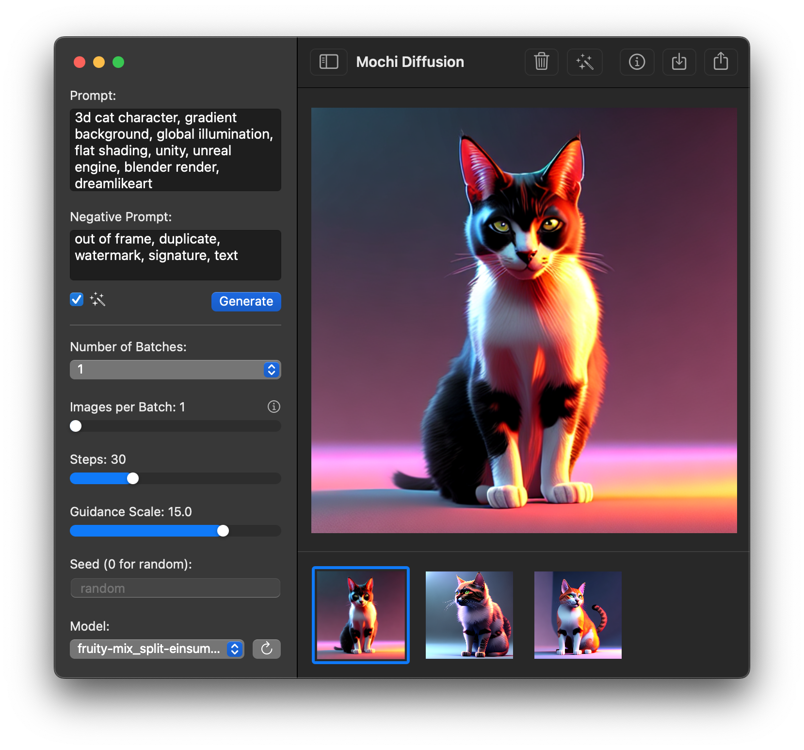

<p align="center">

</p>

<h1 align="center">Mochi Diffusion</h1>

<p align="center">Run Stable Diffusion and FLUX.2 Klein on Mac natively</p>

<p align="center">
<a href="https://github.com/MochiDiffusion/MochiDiffusion/blob/main/README.md">English</a>,
<a href="https://github.com/MochiDiffusion/MochiDiffusion/blob/main/README.ko.md">한국어</a>,
<a href="https://github.com/MochiDiffusion/MochiDiffusion/blob/main/README.zh-Hans.md">中文</a>
</p>

<p align="center">
<a title="Discord" target="_blank" href="https://discord.gg/x2kartzxGv"></a>
<a title="Crowdin" target="_blank" href="https://crowdin.com/project/mochi-diffusion"></a>
<a title="License" target="_blank" href="https://github.com/MochiDiffusion/MochiDiffusion/blob/main/LICENSE"></a>
</p>



Mochi Diffusion is a native macOS app for generating images locally using [Apple's Core ML Stable Diffusion implementation](https://github.com/apple/ml-stable-diffusion) to achieve maximum performance and speed with reduced memory requirements, and the [Iris](https://github.com/antirez/iris.c) pipeline for running FLUX.2 (Klein) models with native Metal GPU acceleration

## Features

- Generate images locally and completely offline
- Generated images are saved with prompt info inside EXIF metadata (view in Finder's Get Info window)
- Built-in gallery with import/save/sync support
- macOS native app using SwiftUI

## Downloads

- Mochi Diffusion
    - [Latest version](https://github.com/MochiDiffusion/MochiDiffusion/releases)
- Core ML Stable Diffusion
    - [Community models](https://huggingface.co/coreml-community#models)
    - [ControlNet models](https://huggingface.co/coreml-community/ControlNet-Models-For-Core-ML/tree/main/CN)
    - [Stable Diffusion 1.5 with ControlNet](https://huggingface.co/coreml-community/coreml-stable-diffusion-v1-5_cn/tree/main/split_einsum)
- FLUX.2 Klein
    - [FLUX.2-klein-4B (distilled)](https://huggingface.co/black-forest-labs/FLUX.2-klein-4B)
    - [FLUX.2-klein-9B (distilled)](https://huggingface.co/black-forest-labs/FLUX.2-klein-9B)

## Models

You will need Core ML Stable Diffusion or FLUX.2 Klein models in order to use Mochi Diffusion.

### Core ML Stable Diffusion

Mochi Diffusion uses Stable Diffusion models which have been specially converted (Core ML) to run on Apple hardware. The advantage of this is that they are extremely fast and memory efficient, especially on Apple Silicon Macs with Neural Engine. The downside is that each model can only generate images of a fixed size which is baked in during the conversion.

Stable Diffusion allows generating images based on another “starting image”, or with ControlNet

#### Compute Unit

- `CPU & Neural Engine` provides a good balance between speed and low memory usage
- `CPU & GPU` may be faster on M1 Max, Ultra and later but will use more memory

Depending on the option chosen, you will need to use the correct model version.

#### Usage

1. [Convert](https://github.com/MochiDiffusion/MochiDiffusion/wiki/How-to-convert-Stable-Diffusion-models-to-Core-ML) or download Core ML models
   - `split_einsum` version is compatible with all compute unit options including Neural Engine
   - `original` version is only compatible with `CPU & GPU` option
2. By default, the app's model folder will be created under your home directory. This location can be customized under Settings
3. In the model folder, create a new folder with the name you'd like displayed in the app then move or extract the converted models here
4. Your directory structure should look like this:

```
<Home Directory>/
└── MochiDiffusion/
    └── models/
        ├── stable-diffusion-2-1_split-einsum_compiled/
        │   ├── merges.txt
        │   ├── TextEncoder.mlmodelc
        │   ├── Unet.mlmodelc
        │   ├── VAEDecoder.mlmodelc
        │   ├── VAEEncoder.mlmodelc
        │   └── vocab.json
        ├── ...
        └── ...
```

When using a model for the very first time, it may take up to 2 minutes for the Neural Engine to compile a cached version. Afterwards, subsequent generations will be much faster.

### FLUX.2 Klein

No conversion is required for FLUX.2 Klein models.

Klein can use up to 4 “input images” in generations. Due to pipeline constraints, it may be necessary to constrain input image dimensions to fit the attention budget. Mochi will automatically resize inputs and indicate the new sizes in the UI.

#### Usage

1. Download `text_encoder`, `tokenizer`, `transformer`, and `vae` for a FLUX.2 Klein model from the [Downloads](#downloads) links above (or use [`download_model.sh`](https://github.com/antirez/iris.c/blob/main/download_model.sh))
2. Place in MochiDiffusion's model folder
3. Your directory structure should look like this:

```
<Home Directory>/
└── MochiDiffusion/
    └── models/
        ├── flux-klein-4b/
        │   ├── text_encoder/
        │   ├── tokenizer/
        │   ├── transformer/
        │   └── vae/
        ├── ...
        └── ...        
```

(see [iris.c issue #12](https://github.com/antirez/iris.c/issues/12)) for specific guidance for flux-klein-4b)

## Compatibility

- Apple Silicon (M1 and later)
- macOS 15.6 and later
- Xcode 26.0 or later (to build)

## Building From Source

The project supports `SharedXcodeSettings` for local overrides to keep per-developer signing state out of the project file.

Create a sibling `SharedXcodeSettings/DeveloperSettings.xcconfig` next to this repository:

```text
directory/
  SharedXcodeSettings/
    DeveloperSettings.xcconfig
  MochiDiffusion/
    Mochi Diffusion.xcodeproj
```

Example `SharedXcodeSettings/DeveloperSettings.xcconfig`:

```xcconfig
CODE_SIGN_IDENTITY = Apple Development
DEVELOPMENT_TEAM = <Your Team ID>
CODE_SIGN_STYLE = Automatic
PROVISIONING_PROFILE_SPECIFIER =
PRODUCT_BUNDLE_IDENTIFIER = com.example.Mochi-Diffusion
```

## Privacy

Mochi Diffusion doesn’t collect any data or telemetry. All generation happens locally and absolutely nothing is sent to the cloud.

## Contributing

Mochi Diffusion is always looking for contributions, whether it's through bug reports, code, or new translations.

- If you find a bug, or would like to suggest a new feature or enhancement, try [searching for your problem first](https://github.com/MochiDiffusion/MochiDiffusion/issues) as it helps avoid duplicates. If you can't find your issue, feel free to [create a new issue](https://github.com/MochiDiffusion/MochiDiffusion/issues/new/choose). Don't create an issue for your question as those are for bugs and feature requests only.

- If you're looking to contribute code, feel free to [open a Pull Request](https://github.com/MochiDiffusion/MochiDiffusion/pulls). I recommend installing [swift-format](https://github.com/apple/swift-format#getting-swift-format) to catch lint issues.

- If you'd like to translate Mochi Diffusion to your language, please visit the [project page on Crowdin](https://crowdin.com/project/mochi-diffusion). You can create an account for free and start translating and/or approving.

## Credits

- [Apple's Core ML Stable Diffusion implementation](https://github.com/apple/ml-stable-diffusion)
- [iris.c](https://github.com/antirez/iris.c)
- [Hugging Face's Swift UI sample implementation](https://github.com/huggingface/swift-coreml-diffusers)
- App Icon by [Zabriskije](https://github.com/Zabriskije)
